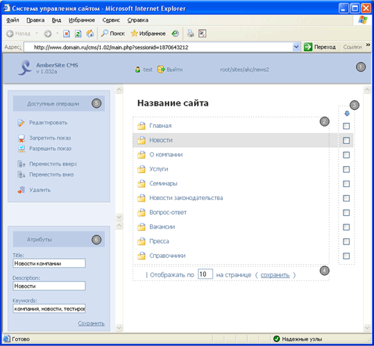

## © 2008 | AmberSite.CMS

*Разработчик: Мурзин Андрей. andreu_mail@mail.ru*  

### О проекте
AmberSite.CMS — система управления сайтами от компании "Янтаное небо" г. Челябинск.  
Руководство пользователя — [AmberSiteCMS.doc](AmberSiteCMS.doc).  
Текущий репозитории содержит только frontend-часть системы.

### Используемые технологии
Проект представляет собой **доисторическое Web SPA-приложение**, которое реализовано на чистом JS (ES3) + PHP.  
Используемые технологии: PHP, HTML, CSS, JS, AJAX, XML/XSLT.

### Особенности реализации
Функционал в системе разбит на независымые модули.  
Каждый модуль подключен к общему каналу и имеет возможность реагировать на любые события от системы или генерировать
собственные события (аналог современного Redux).  
HTML формируется на клиенте путем XSLT-преобразования входящих XML данных (XSLT-шаблоны грузятся при инициализации).

